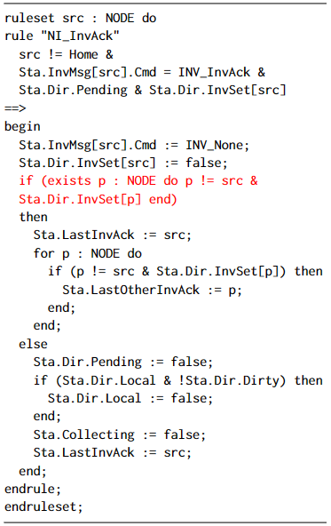
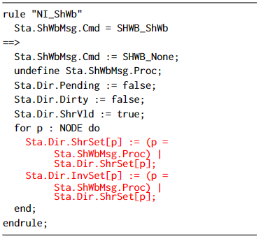

# auto-CMP
we only need provide two input files in a case study:
1.  prot.m: the protocol file im Murphi, which is under parameterized verification.

2. abs_process.csv: the CMP-abstraction information lines for the protocol. Each line records a  Murphi rule and the non-interference lemmas which are used for guard strengthening the rule

Output files are as follows:
1. Our tool murphiGen can automatically generate the abstract protocol model and invariants for observation in a file absProt.m 

2. The Tool proofGen can automatically generate a proof script Prot.thy certificating the correctness of the CMP-abstraction.


# System FrameWork

Our method uses Murphi for model check, and the results are processed in Python program. Finally, we use Python to generate Prot.thy file and put it into Isabelle for proof.

# Requirement

Cmurphi 5.5.0 

http://mclab.di.uniroma1.it/site/index.php/software/18-cmurphi

Isabelle 2021 

https://isabelle.in.tum.de/installation.html

Python 3.8.12

Lark 1.1.2

Note that these programs runs on MAC or Linux system

# Run an Example

1. Download the software and libraries mentioned above

2. Modify the file settings.py, set the variables MU_PATH, MU_INCLUDE, GXX_PATH, which mean path of CMurphi, path of include directory of CMurphi and path of g++ compiler respectively. MU_FILE_DIR refers to when CMurphi is called to check protocol, a directory is created under MU_FILE_DIR to hold temporary files, and you can change it to where you want. MU_CHECK_MEMORY indicates how much memory you will allocate to the CMurphi program.

3. Run the file murphiGen.py --task prot, in which the parameter ‘prot’ represents the name of protocol you want to verify. It will automatically perform CMP work until ‘success!’ is displayed on the terminal.

   ```
   python murphiGen.py --task mutualEx
   ```

   After step 3, a file named ABSprot.m will appear in the path ./prot/, which is the final abstract protocol. In the meantime, the information about the strengthen process and lemmas will be contained in abs_process.csv in the folder corresponding to the protocol. 

4. Then run proofGen.py --task prot to generate the proof file prot.thy(prot has the same meaning as above). This program will first generate a prot_str.json file in the current directory using abs_process.csv and ABSprot.m mentioned above, which records the enum type of the protocol and the description of the rule (detailed below). This file and the abstract protocol ABSprot.m are used to generate the prot.thy proof file. You can complete the proof process by putting the file into Isabelle.

   ```
   python proofGen.py --task mutualEx
   ```

## ABSprot.m

The ABSprot.m is an abstraction of the original protocol. It contains the original and abstracted rules, as well as variable definitions, initializations, and invariants, etc.


## prot_str.json

prot_str.json records the information of protocol. 

The first item “enum_typs” records elements of type “enum” in the protocol, and the following items contain information about each rule or ruleset. In these items, the first element is the name of a rule or ruleset, and the next are the names of the noninterference lemmas used to strengthen their guard. Note that these lemmas are listed in reverse order of use. 

The third element named “answer”, which is the name of original rule (or ruleset) to distinguish between its abstracted rule. 

The last element, “abstract”, represents abstract information about rules. In this element, “cond” is the signal of parameter information, and when a parameter is false, that parameter is abstracted for this rule. Similarly, “answer” in “abstract” represents the name of the ruleset, except that the name of the abstract ruleset is prefixed or suffixed. Since rules only have global variables that do not need to be abstracted, their terms “strengthen” and “abstract” are empty.

Take the mutualEx protocol as an example: its first item contains its enum type, "state", and then in the last item, "ruleset" means that the ruleset is "Idle" and "strengthening" means that "Lemma_1" is used to strengthen the rule. Its original rule name is "Idle_ref", while its abstract rule name is "ABS_Idle", which are both contained in "answer".

In the other items, the "strengthen" of "Crit" is empty because its abstract form is the same as the original rule and has not been strengthened. "Try" and "Exit" don't exist after abstraction, so the content in "answer" is replaced by "skipRule".
```
 [

{

  "enum_typs": [

​        "state"

   ]

},

{

  "ruleset": "Try",

  "strengthen": [  

  ],

  "answer": "Try_ref",

  "abstract":[{"cond":{"i": true},"answer":"Try_ref"},{"cond":{"i": false},"answer":"skipRule"}]

},

{

  "ruleset": "Crit",

  "strengthen": [

  ],

  "answer": "Crit_ref",

  "abstract":[{"cond":{"i": true},"answer":"Crit_ref"},{"cond":{"i": false},"answer":"ABS_Crit"}]

},

{

  "ruleset": "Exit",

  "strengthen": [  

  ],

  "answer": "Exit_ref",

  "abstract":[{"cond":{"i": true},"answer":"Exit_ref"},{"cond":{"i": false},"answer":"skipRule"}]

},

{

  "ruleset": "Idle",

  "strengthen": [

​    "Lemma_1"

  ],

  "answer": "Idle_ref",

  "abstract":[{"cond":{"i": true},"answer":"Idle_ref"},{"cond":{"i": false},"answer":"ABS_Idle"}]

}

]
```


## Prot.thy

Prot.thy consists of the following parts:

1. Definitions of formally parameterized rules and the initial state of the original protocol under study, which can be directly transformed from the internal model which is in turn compiled from Murphi rules of the protocol. The set of all the parameterized rules are defined in a set ***rules***.

2. Definitions of parameterized invariant formulas ***inv_i*** for strengthening, which are generated by external oracle or human. All invariant formulas used to strengthen a rule ***r*** is collected in an invariant list ***invsFor_r.*** All such invariant in lists ***invsFor_r*** are collected in an set ***invS***. Accordingly, we define ***inv'*** for those for observation, and an invariant list ***invs'For_r***, and ***invS'*** accordingly.

3. Definitions of rules ***r_ref*** of the parameterized protocol by strengthening some original protocol rule ***r*** with invariant list ***invsFor_r***, which can be generated in the CMP phase. The set of all the parameterized rules are defined in a set ***rules_ref***.

4. Definitions of rules of the abstracted protocol model, which can be generated in the CMP~ phase. The set of all the parameterized rules are defined in a set ***ABSrules.***

5.  Definitions of the types of variables used in this protocols by a function ***env***. 

6. Lemmas that guaranttees obligations of the symmetry of strengthened rule ***r_ref***, and invariant formulas ***inv_i*** and initial state specification formulas ***init_i***, which is required in obligation in the main theorem.

7. A lemma which guaranttees the obligation  which states that ***rules_ref***. is strengthened by ***rules*** with ***invS*** in main theorem. 

8. A lemma which proves the obligation that ***ABSrules(M)*** is indeed the image of the rule abstracting function ***absRuleTranfer*** ~on the middle set ***rules_ref*** with a cut-off parameter ***M***.  

9. A lemma which proves the obligation  that is the correspondence between ***invS*** --lists of invariants for strengthening rules and ***invS’--*** invariants for observation.

10. A lemma which proves the obligation that ***invS’--***the lists of invariants for observation is safe and well typed by ***env***. In fact, we can furthermore that the abstraction results of these invariants is the same as themself in our case studies.

11. Lemmas which prove that original rules and those in the middle reference protocol (the strengthening result) ***rules_ref*** are well typed. 

12. A lemma which proves that the initial state specification formulas ***inv_i*** are also well-typed. 

13. The main theorem ***absProtSim*** states the correctness of the parameterized protocol under the assumption that the model checking of the abstracted protocol is positive.

 

# Results

In the main directory, we place the main results of our work:

1. The abstract protocol model in Murphi:

    (1)  AbsmutualEx.m

    (2)  AbsGerman.m

    (3)  AbsMesi.m

    (4)  AbsFlash.m

2. The Isabelle Proof Script file:

    (1)  MutualEx.thy

    (2)  German.thy

    (3)  Mesi.thy

    (4)  Flash.thy

3. By our experiments, we have found some errors in the classical work of CMP field [1].  

# C Unsound abstraction of Rule $\mathtt{NI\_Local\_Get\_Get}$

For rule $\mathtt{NI\_Local\_Get\_Get}$ (Figure 12), its guard contains the conjunct $\mathit{Dir.HeadPtr}\neq \mathit{src}$, and this was abstracted to $\mathit{Dir.HeadPtr}\neq \mathit{Other}$ in [1](result in Figure 13). However, this is not a conservative abstraction: it neglects the case where $\mathit{Dir.HeadPtr}$ and $\mathit{src}$ are different indices greater than $M$. In this case, both would be abstracted to $\mathit{Other}$, so that $\mathit{Dir.HeadPtr}\neq \mathit{src}$ is $\mathsf{True}$ but $\mathit{Dir.HeadPtr}\neq \mathit{Other}$ is $\mathsf{False}$. We removed this conjunct from the abstraction of the rule (equivalent to abstracting it to $\mathsf{True}$).

<center>
    
</center>

# D rule $\mathtt{NI\_InvAck}$

In [1], rule $\mathtt{NI\_InvAck}$ and its abstraction $\mathtt{Abs\_NI\_InvAck}$ are shown in Figure 14 and Figure 15. Here $\mathtt{NODE}$ in Figure 14 represents parameter list $[1\cdots N]$, while that in  Figure 15 represents parameter list $[1\cdots M]$.
Here statement if $b$ then $S$ endif abbreviates if $b$ then $S$ else $\mathsf{skip}$. This abstraction is not correct because $\bigvee_{p=1}^{N} p \neq i \land \mathit{Sta.Dir.InvSet}[p]$  is not $\mathit{safe}$, and $\bigvee_{p=1}^{M} \mathit{ Sta.Dir.InvSet }[p]$  is not the abstraction of $\bigvee_{p=1}^{N} p \neq i \land \mathit{Sta.Dir.InvSet}[p]$ too. Therefore, the $\mathsf{CMP}$ result in [1] is problematic. In order to solve this problem, we split the rule into two rules $\mathtt{NI\_InvAck_1}$ and $\mathtt{NI\_InvAck_2}$, which are shown in Figure 16 and Figure 17. Notice that $\bigwedge_{p=1}^{N} p \ne i \longrightarrow \neg \mathit{Sta.Dir.InvSet}[𝑝]$ is the negation of  $\bigvee_{p=1}^{N} p \neq i \land \mathit{Sta.Dir.InvSet}[p]$. Besides, we find that variable $\mathit{Sta.LastOtherInvAck}$ is not read in any statement or guard but only modified in the FLASH protocol, we remove this variable and the corresponding assignments. 

<center>
    
</center>

<center>
    
</center>


# E Rule $\mathtt{NI\_ShWb}$
Rule $\mathtt{NI\_ShWb}$ and its abstraction $\mathtt{ABS\_NI\_ShWb}$ are shown in Figure 18 and Figure 19. This abstraction is highly irregular. We rewrite the rule $\mathtt{NI\_ShWb}$ into a form that can be abstracted following our syntax-directed procedure, and so can be processed by {\sf autoCMP}. It involves adding a parameter $\mathit{src}$ and requiring it to equal $\mathit{Sta.ShWbMsg.Proc}$ in the conditions, so that within the rule $\mathit{Sta.ShWbMsg.Proc}$ can be replaced by $\mathit{src}$. Further, the loop of assignments is split into assignments over $p\neq \mathit{src}$ and assignment on $\mathit{src}$. The result is shown in Figure 20, and the result of abstraction according to syntax-directed procedure is shown in Figure 21, which is equivalent to the result in Figure 19.

<center>
    
</center>

<center>
    
</center>


[1]Ching-Tsun Chou, Phanindra K. Mannava, and Seungjoon Park. 2004. A Simple Method for Parameterized Verification
of Cache Coherence Protocols. In Proc. 5th International Conference on Formal Methods in Computer-Aided Design
(FMCAD’04) (Lecture Notes in Computer Science, Vol. 3312). Springer, 382–398

 