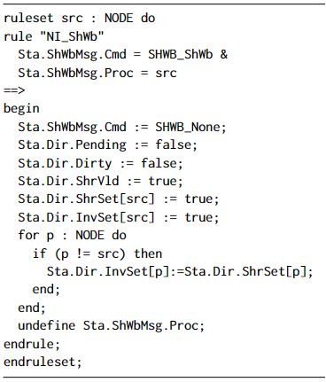

# A Type system

# B Complex protocol rules in FLASH and their abstractions

In this section, we use rule $\mathtt{NI\_Remote\_GetX\_PutX}(src,dst)$, as shown in Figure 6, to demonstrate the complexity of FLASH when we apply $\mathsf{CMP}$ to this protocol. 
- Rule $\mathtt{NI\_Remote\_GetX\_PutX}({\it src},{\it dst})$ is triggered when node ${\it src}$ asks for an exclusive copy of the cache when cache state of node ${\it dst}$ is exclusive.
    
- Two invariants $\mathtt{inv}\_1$ and $\mathtt{inv}\_3$, as shown in Figure 8 and Figure 9, are used to to strengthen the rule into $\mathtt{NI\_Remote\_GetX\_PutX\_ref}(N,{\it src},{\it dst})$, which are shown in Figure 7. Here $\mathtt{inv}\_1$ is obtained by merging nine small invariants with the same antecedent, and similarly $\mathtt{inv}\_3$ is obtained by merging another five small invariants. Furthermore, $\mathtt{inv}\_3$ is of different kind because both ${\it src}$ and ${\it dst}$ occur in the antecedent, and ${\it dst}$ also occurs in the consequent. We directly use $\mathtt{inv}\_3({\it src},{\it dst})$ to strengthen $\mathtt{NI\_Remote\_GetX\_PutX}(src,dst)$, and observe $\mathtt{inv}\_3(1,2)$ in the abstracted FLASH protocol.
    
- By case analysis on comparing each parameter $i$ of a rule $r$ with the cut-off $M=2$, we compute four different kinds of abstractions. For example, for the above rule $\mathtt{NI\_Remote\_GetX\_PutX}\_{\it ref}$, when $src\le M$ and $dst>M $, the abstraction result is $\mathtt{ABS\_NI\_Remote\_GetX\_PutX\_dst}(src)$ as shown in Figure 10; and when $src>M$ and $dst> M$, the corresponding abstraction result is $\mathtt{ABS\_NI\_Remote\_GetX\_PutX\_src\_dst}$, as shown in Figure 11.

    
     
    
Fig.6. Rule NI_Local_GetX_PutX

    
     
    
Fig.7. Rule $NI_Remote_GetX_PutX_ref

    
     
    
Fig.8. Invariant inv_1

    
     
    
Fig.9. Invariant inv_3

    
     
    
Fig.10. ABS_NI_Remote_GetX_PutX_dst

    
     
    
Fig.11. ABS_NI_Remote_GetX_PutX_src_dst

# C Unsound abstraction of Rule $\mathtt{NI\_Local\_Get\_Get}$

For rule $\mathtt{NI\_Local\_Get\_Get}$ (Figure 12), its guard contains the conjunct $\mathit{Dir.HeadPtr}\neq \mathit{src}$, and this was abstracted to $\mathit{Dir.HeadPtr}\neq \mathit{Other}$(result in Figure 13). However, this is not a conservative abstraction: it neglects the case where $\mathit{Dir.HeadPtr}$ and $\mathit{src}$ are different indices greater than $M$. In this case, both would be abstracted to $\mathit{Other}$, so that $\mathit{Dir.HeadPtr}\neq \mathit{src}$ is $\mathsf{True}$ but $\mathit{Dir.HeadPtr}\neq \mathit{Other}$ is $\mathsf{False}$. We removed this conjunct from the abstraction of the rule (equivalent to abstracting it to $\mathsf{True}$).

    
     
    
Fig.12. Rule NI_Local_Get_Get

    
     
    
Fig.13. Rule ABS_NI_Local_Get_Get

# D rule $\mathtt{NI\_InvAck}$

rule $\mathtt{NI\_InvAck}$ and its abstraction $\mathtt{Abs\_NI\_InvAck}$ are shown in Figure 14 and Figure 15. Here $\mathtt{NODE}$ in Figure 14 represents parameter list $[1\cdots N]$, while that in  Figure 15 represents parameter list $[1\cdots M]$.
Here statement if $b$ then $S$ endif abbreviates if $b$ then $S$ else $\mathsf{skip}$. This abstraction is not correct because $\bigvee_{p=1}^{N} p \neq i \land \mathit{Sta.Dir.InvSet}[p]$  is not $\mathit{safe}$, and $\bigvee_{p=1}^{M} \mathit{ Sta.Dir.InvSet }[p]$  is not the abstraction of $\bigvee_{p=1}^{N} p \neq i \land \mathit{Sta.Dir.InvSet}[p]$ too. Therefore, the $\mathsf{CMP}$ result is problematic. In order to solve this problem, we split the rule into two rules $\mathtt{NI\_InvAck_1}$ and $\mathtt{NI\_InvAck_2}$, which are shown in Figure 16 and Figure 17. Notice that $\bigwedge_{p=1}^{N} p \ne i \longrightarrow \neg \mathit{Sta.Dir.InvSet}[𝑝]$ is the negation of  $\bigvee_{p=1}^{N} p \neq i \land \mathit{Sta.Dir.InvSet}[p]$. Besides, we find that variable $\mathit{Sta.LastOtherInvAck}$ is not read in any statement or guard but only modified in the FLASH protocol, we remove this variable and the corresponding assignments. 

    
     
    
Fig.14. Rule NI_InvAck

    
     
    
Fig.15. Rule ABS_NI_InvAck

    
     
    
Fig.16. Rule NI_InvAck_1

    
     
    
Fig.17. Rule NI_InvAck_2

# E Rule $\mathtt{NI\_ShWb}$
Rule $\mathtt{NI\_ShWb}$ and its abstraction $\mathtt{ABS\_NI\_ShWb}$ are shown in Figure 18 and Figure 19. This abstraction is highly irregular. We rewrite the rule $\mathtt{NI\_ShWb}$ into a form that can be abstracted following our syntax-directed procedure, and so can be processed by {\sf autoCMP}. It involves adding a parameter $\mathit{src}$ and requiring it to equal $\mathit{Sta.ShWbMsg.Proc}$ in the conditions, so that within the rule $\mathit{Sta.ShWbMsg.Proc}$ can be replaced by $\mathit{src}$. Further, the loop of assignments is split into assignments over $p\neq \mathit{src}$ and assignment on $\mathit{src}$. The result is shown in Figure 20, and the result of abstraction according to syntax-directed procedure is shown in Figure 21, which is equivalent to the result in Figure 19.

    
     
    
Fig.18. Rule NI_ShWb

    
     
    
Fig.19. Rule ABS_NI_ShWb

    
     
    
Fig.20. Our remodelling of rule NI_ShWb

    
     
    
Fig.21. Our abstraction of rule NI_ShWb

